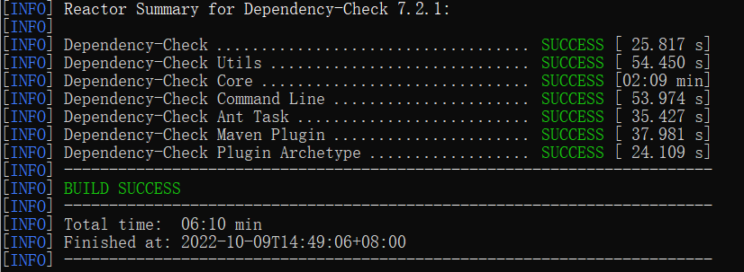
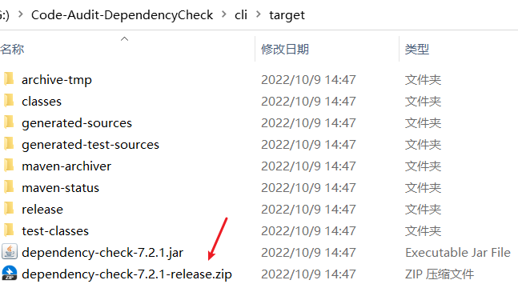
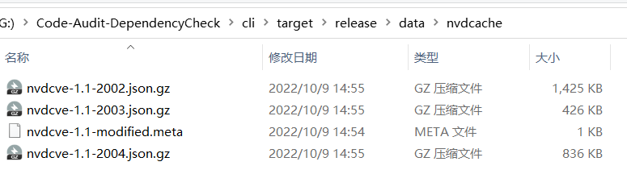

# Code-Audit-DependencyCheck

## 简介
代码安全组件扫描-DependencyCheck升级版，增加对maven项目pom.xml文件引用的依赖jar进行组件漏洞扫描并输出指定模板样式报告

## 编译环境

- [x] java :  `java -version` 1.8
- [x] maven :  `mvn -version` >= 3.5.0

## 调试

1. 用VS Code打开文件夹```Code-Audit-DependencyCheck```
2. 等待```JAVA PROJECTS面板```加载完毕后，然后```组合键Ctrl+F5```
3. 选择主类: ```org.owasp.dependencycheck.App```

## 编译与发布

1. 下载官方原版DependencyCheck源码，进入项目根目录下，执行编译命令：```mvn -s settings.xml clean install -DskipTests=true```

   

   

2. 初始编译完成后发布的版本不含漏洞库：```Code-Audit-DependencyCheck\cli\target\dependency-check-7.2.1-release.zip```



3. 若需要包含最新漏洞库的版本：执行更新库命令```Code-Audit-DependencyCheck\cli\target\release\bin\dependency-check.bat --updateonly```

   下载好的漏洞库文件在`Code-Audit-DependencyCheck\cli\target\release\data\nvdcache`目录下

   

   

4. 然后打包```Code-Audit-DependencyCheck\cli\target\release```生成新的```dependency-check-7.2.1-release.zip```


## 使用方式

```python
python Code-Audit-Depend.py [-p指定项目地址] [-b指定项目分支] [-l指定本地项目路径] [-g指定gitlab地址] [-t指定gitlab库token]
可按需指定远程githu本项目地址和具体分支/本地项目路径/gitlab项目地址进行JAVA组件漏洞扫描
```


## 改动文件
```
core\src\main\java\org\owasp\dependencycheck\analyzer\JarAnalyzer.java
core\src\main\java\org\owasp\dependencycheck\xml\pom\PomParser.java增加parsePomXML方法
core\src\main\java\org\owasp\dependencycheck\xml\pom\PomUtils.java增加readPomXML方法
core\pom.xml添加maven-model组件
编译后的dependency-check\lib目录下添加maven-model.jar和plexus-utils.jar文件
```
## 优化项
- [x] 增加maven pom.xml文件中依赖漏洞扫描

- [x] 优化输出html报告中锚点定位问题

- [ ] 下载maven cve库和最新版本到本地进行离线更新